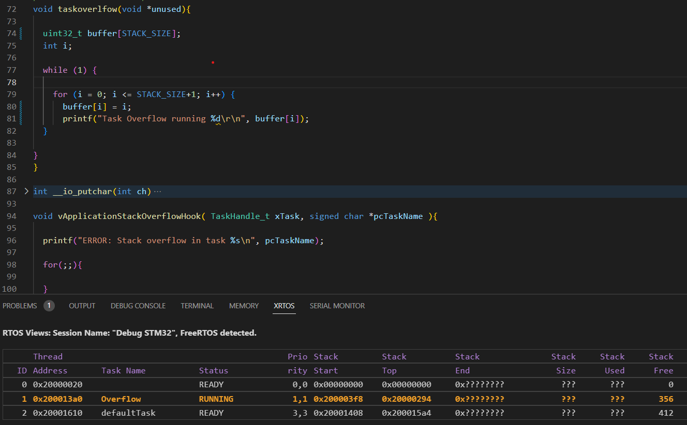
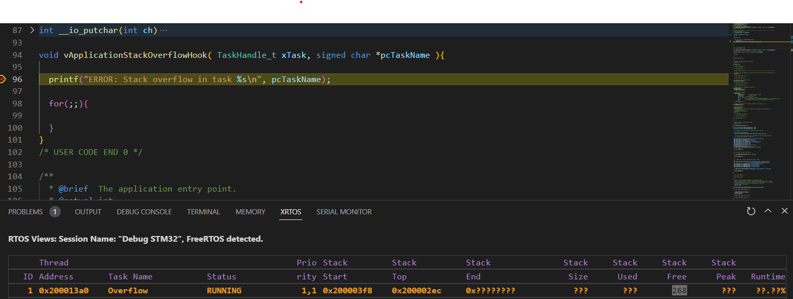

# FreeRTOS

## Prise en main

1. Le fichier main.h et main.c se situent dans le dosseir Core, sous Inc et Src respectivement.
2. Les balises BEGIN et END indiquent l'emplacment des codes utilisateurs. En dehors, le code ne sera pas prit en compte.

## FreeRTOS, tâches et sémaphores

### Tâche simple

1. La taille du heap est utilisé pour allouer de la mémoire aux tâches. Selon les besoins du programme, la taille alloué peut etre augmenté. Par défault, 15 Ko sont alloés pour FREERTOS sur STM32F74.
2. Le rôle de la macro portTICK_PERIOD_MS, définit à 1, est de définir la fréquence de FreeRTOS à 1 ms.
   La fonction VTaskDelay attend en paramètre le nombre de tick afin d'effectuer une temporisation.
   Donc, on va diviser le délais souhaité par la période du tick de l'OS.

### Sémaphores pour la synchronisation

6. En changeant les priorités, par exmeple la tâche Take au dessus de la tâche Give, la sémaphore n'a pas eu le temps d'être bloqué par la tache Give et donc pas prise la tache Take.

### Réentrance et exclusion mutuelle

11. Le problème vient du fait que les tâches accèdent à la fonction affichage simultanément, sans prise en compte de la disponibilité. En utilsiant un sémaphore ou un mutex, on pourra garantir l'accès à la fonction d'afficahge selon les priorités des tâches.

## On joue avec le Shell

2. Si on respecte pas les mécanismes de priorité défini par FreeRTOS, l'interruption n'a pas eu lieu dans l'OS.

## Debug, gestion d’erreur et statistiques

### Gestion de tas

1. Le nom de la zone réservée à l’allocation dynamique est le tas (heap).

2. Le tas est géré par FreeRtos.

4. Afin de connaitre l'espace de stockage disponible de la RAM et la FLASH, on retrouve les informations dans les fichiers .id générés par CubeMX.

~~~
/* Memories definition */
MEMORY
{
  RAM    (xrw)    : ORIGIN = 0x20000000,   LENGTH = 320K
  FLASH    (rx)    : ORIGIN = 0x8000000,   LENGTH = 1024K
}
~~~

Concernant l'espace utilisé, on va intérpréter les résultats des commandes "arm-none-eabi-size" : 
~~~
   text    data     bss     dec     hex filename
  13660      24   18096   31780    7c24 build/rtos_td_shell.elf
~~~
- La taille de la RAM utilisée est donné par l'addition des colonnes data et bss
- La taille de la FLASH utilisé est donné par l'addition des colonnes data et text

Dans un programme compilé sans tâche, 
- la RAM utilisé est de 18 ko sur 320 ko disponible, soit  %.
- la FLASH utilisé est de 13 ko sur 1024 ko disponible, soit  %.

5. Tâche overflow avec incrémentation d'un pointeur

6. Utilisation de le mémoire dans un programme avec la tâche overflow
~~~
   text    data     bss     dec     hex filename
  18208     116   18436   36760    8f98 build/rtos_td_shell.elf
~~~
- la RAM utilisé est de 18 ko sur 320 ko disponible, soit  %.
- la FLASH utilisé est de 18 ko sur 1024 ko disponible, soit %.

7. En augmentant la taille du HEAP,
~~~
   text    data     bss     dec     hex filename
  18212     116   28076   46404    b544 build/rtos_td_shell.elf
~~~

  - la RAM utilisé est de 28 ko sur 320 ko disponible, soit  %.
- la FLASH utilisé est de 18 ko sur 1024 ko disponible, soit  %.

#### Gestion des piles 

4. En mode debug, on observe lors de d'un overlfow de la pile, la fonction vApplicationStackOverflowHook est appelé.

5. Pour le dépassement de la pile, il y a une seconde méthode.
En configurant, CHECK_FOR_STACK_OVERFLOW à 2, la méthode de détection est similaire à la première méthode. Mais, elle vérifie en plus la disponibilité de la pile.

